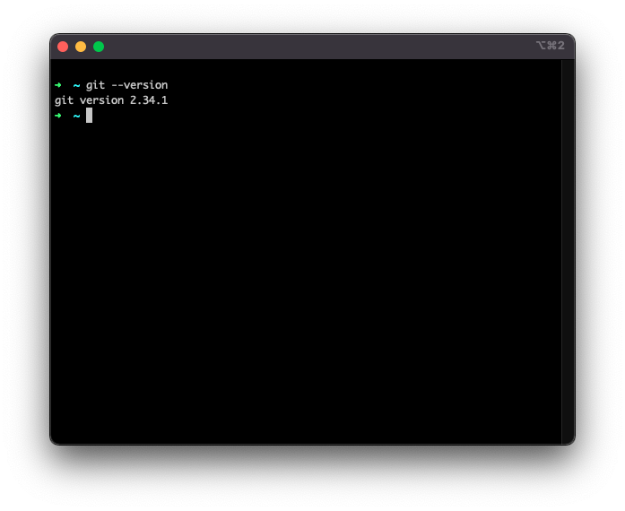
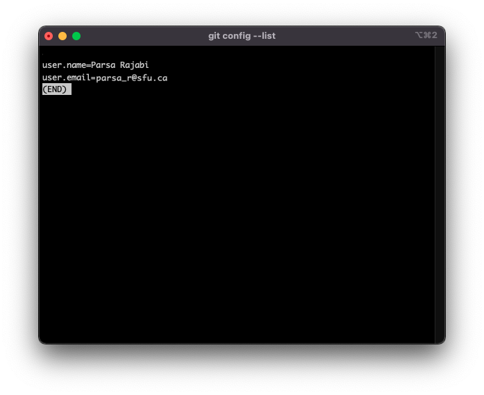
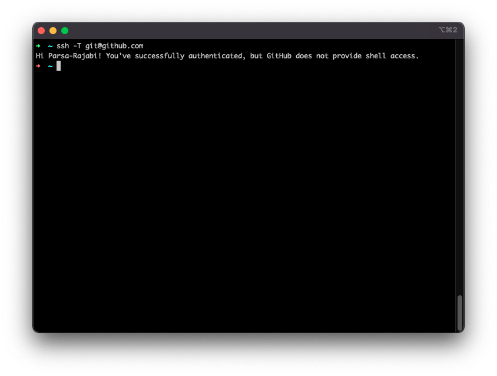
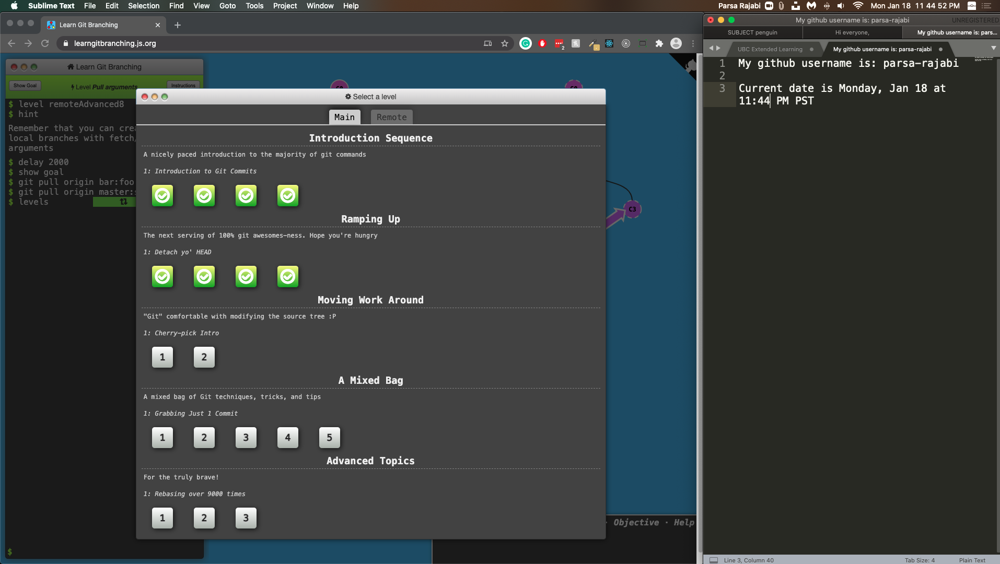
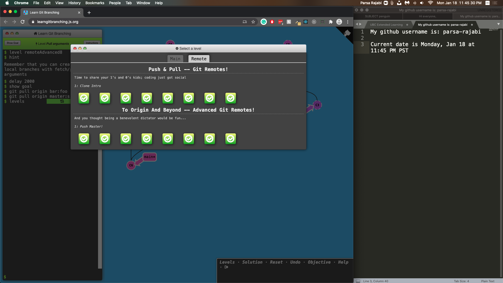

# Lab 1

This week, you will complete the following tasks:
1. Ensure your computer is set up with Git 
2. Complete a Github Tutorial 
3. Answer some questions about Git and Github
4. Watch a video on Software Development Life Cycle (SDLC) and answer some questions

## :octocat: Git and GitHub

Git is a **distributed Version Control System (VCS)**, which means it is a useful tool for easily tracking changes to your code, collaborating, and sharing. With Git you can track the changes you make to your project so you always have a record of what you’ve worked on and can easily revert back to an older version if need be. It also makes working with others easier—groups of people can work together on the same project and merge their changes into one final source!

### Resources

* [A short video explaining what GitHub is](https://www.youtube.com/watch?v=w3jLJU7DT5E&feature=youtu.be) 
* [Git and GitHub learning resources](https://docs.github.com/en/github/getting-started-with-github/git-and-github-learning-resources) 
* [Understanding the GitHub flow](https://guides.github.com/introduction/flow/)
* [Interactive Git training materials](https://githubtraining.github.io/training-manual/#/01_getting_ready_for_class)
* [Git cheat sheet](https://education.github.com/git-cheat-sheet-education.pdf)

## Prepare your System (1 mark)

### Install Git

1. Use the following tutorial to install Git on your computer: 
> [github.com/git-guides/install-git](https://github.com/git-guides/install-git)

### Configuring Git user info 

2. Next, we need to configure Git by telling it your name and email. To do this type the following into the Terminal (the same ones you used to sign up for GitHub):

```shell
git config --global user.name "YOUR NAME HERE"
git config --global user.email YOUR@EMAIL.com
```

### Add your SSH key to your Github account 

3. Using the SSH protocol, you can connect and authenticate to remote servers and services. With SSH keys, you can connect to GitHub without supplying your username and personal access token at each visit.

Use the following tutorials to add your SSH key
> [Check for existing SSH key](https://docs.github.com/en/authentication/connecting-to-github-with-ssh/checking-for-existing-ssh-keys)
>
> [Generating a new SSH key and adding it to the ssh-agent](https://docs.github.com/en/authentication/connecting-to-github-with-ssh/generating-a-new-ssh-key-and-adding-it-to-the-ssh-agent)
> 
> [Adding a new SSH key to your Github account](https://docs.github.com/en/authentication/connecting-to-github-with-ssh/adding-a-new-ssh-key-to-your-github-account)
>
> [Testing your SSH connection](https://docs.github.com/en/authentication/connecting-to-github-with-ssh/testing-your-ssh-connection)

## Preparing your System: What to Submit

- Run the following commands in your terminal and take a screenshot of the output, and also include a text file where you write your github username and the current date/time.

```shell
git --version
```


```shell
git config --list
```



```shell
ssh -T git@github.com
```




## Github Tutorial (12 marks)

Git/GitHub is a difficult tool to teach however, this [interactive tutorial](http://learngitbranching.js.org) does a great job at introducing the key elements and provide a safe sandbox to experiment and learn. This tutorial will help you get more familiar with git commands, particularly branching, and merging - things you will start encountering when you start collaboratively working in your repos.

At minimum, you are responsible for completing the following modules:

### Main Tab: 

- "Introduction Sequence"
    - Exercise 1
    - Exercise 2
    - Exercise 3
    - Exercise 4

- "Ramping up"
    - Exercise 1
    - Exercise 2
    - Exercise 3
    - Exercise 4

### Remote Tab: 

- "Push & Pull -- Git Remotes"
    - Exercise 1
    - Exercise 2
    - Exercise 3
    - Exercise 4
    - Exercise 5
    - Exercise 6
    - Exercise 7
    - Exercise 8

- "To Origin And Beyond -- Advanced Git Remotes!"
    - Exercise 1
    - Exercise 2
    - Exercise 3
    - Exercise 4
    - Exercise 5
    - Exercise 6
    - Exercise 7
    - Exercise 8

You will get 0.5 mark for each activity, for a total of 24 marks.

## Github Tutorial: What to Submit

Include a screenshot of both the exercises in "Main" and "Remotes" tabs, and also include a text file where you write your github username and the current date/time.

Here is an example of the screenshot (if you want full marks you will have completed all 24 exercises).





## Lab Questions [8 marks]

Include the answers to the following questions in your README file. Make sure to cite any sources you use (e.g., links to articles, videos, etc.). 

1. `[1 marks]` What is the difference between Git and Github?
2. `[2 marks]` What is a distributed version control system?
3. `[1.5 marks]`Explain the 3 states of git in your words.
4. `[2.5 marks (0.5 each)]` In your own words, describe the following git commands:
   1. `git clone`
   2. `git status`
   3. `git fetch`
   4. `git init`
   5. `git log`
5. `[1 mark]` What is a `.gitignore` file and its purpose?

## Video and Questions [4 marks]

Watch the video below and answer the following questions:

### Video

[Software Development Life Cycle (SDLC)](https://www.youtube.com/watch?v=i-QyW8D3ei0)

### Questions

Include the answers to the following questions in your README file.

1. `[2 marks]` Summarize the video into 4-5 sentences
2. `[2 marks]` In your own words, explain why Software Development Life Cycle (SDLC) is important in software projects.  
