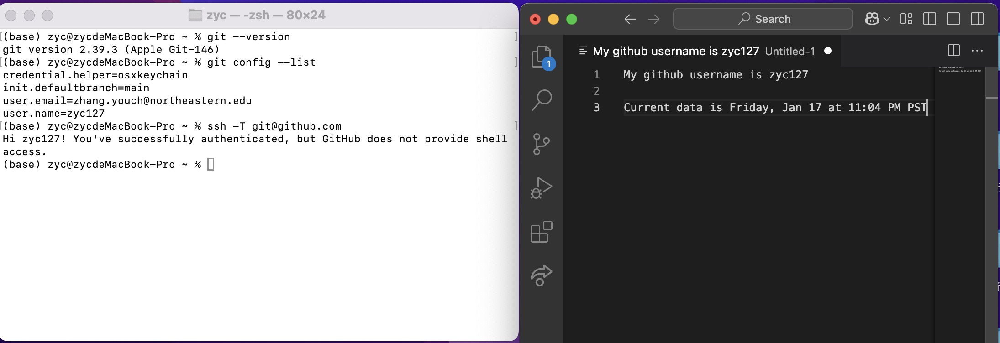
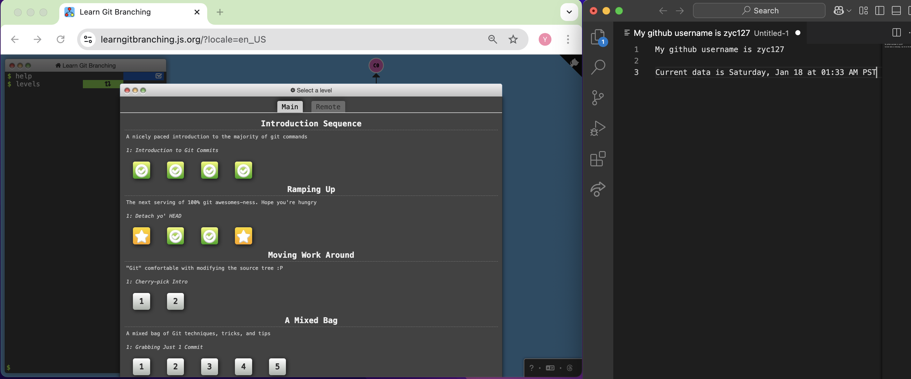
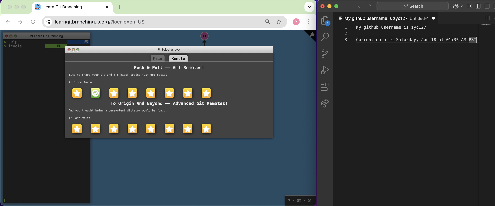

# Lab 1 (25 marks)

[View Lab Instructions Here](L1.md)

[How to use Github / How to submit](https://parsa-rajabi.github.io/CS-5500/#/labs?id=github-classroom)

For this lab, you will include all of your "answers" in this README file. Make sure to cite any sources you use. 

Reminder, this is the syntax to include an image in a markdown (`.md`) file:
```markdown


Example - if a file called test.png was located in this folder:

```

## Task 0: Declare your AI Usage

After you completed this lab, make sure to submit the AI declaration form via MS Form and also upload a PDF copy of your responses to this repository and include the link to PDF in this README file. Note, you must submit this form regardless if you use AI or not. Failure to submit this form will be considered a violation of AI course policy. More details about the AI-usage course policy can be found [here](https://parsa-rajabi.github.io/CS-5500/#/ai-policy).

[Link to AI Usage Disclosure MS Form](https://parsa-rajabi.github.io/CS-5500/#/ai-policy?id=disclosure-of-ai-use)

- You will need to log in with your SFU email to access the form. If you're unsuccessful, try using a different browser or incognito mode. Clearing your cache and cookies may also help.

Name the file in the following format: 

`L#_AI_Declaration_FirstName_LastName_StudentID.pdf`

Example (Lab 3):

`L3_AI_Declaration_Parsa_Rajabi_123456789.pdf`


More detailed submission instructions can be found via the [lab page](https://parsa-rajabi.github.io/CS-5500/#/labs).

Link: [AI Declaration form-Youcheng Zhang](./L1_AI_Declaration_Youcheng_Zhang_002879496.pdf)


## Task 1: Prepare your System (1 mark)



## Task 2: GitHub Tutorial (24 marks)




## Task 3: Lab Questions (11 marks)

### Q1
Git is a version control tool which is used for managing code changes. Whereas github used for sharing and collaborating on git repositories. 

### Q2
A distributed version control system is a system that allows every user who works on a project to have project updating history and a full copy of the project. Users can go back to previous versions, store current changes and share updates with others who work on the same project at any time.

### Q3
Working Directory: Local directory where changes are made.
Staging Area: Temporary area where changes are saved for next commit.
Repository: Place where commited changes are permanently stored.

### Q4

#### Q4 (i) 
Copy a remote repository to local directory.

#### Q4 (ii)
Show the current status of the working directory.

#### Q4 (iii)
Check for changes in the remote repository without merging them into local directory.

#### Q4 (iv)
Creates a empty git repository in current directory.

#### Q4 (v)
Show commit history. 

### Q5
A .gitignore file lists files and folders you don't want to track when making changes, it tells git which files or folders to ignore. It is used to avoid adding data you don't want to add to the repository such as unnecessary or temporary files.

## Task 4: Video Questions (4 marks)

### Q1
The video explains the Software Development Life Cycle with seven stages, which are planning, requirement analysis, design, implementation, testing, deployment, and maintenance. Project goals are defined in planning, features and details are outlined in requirement analysis, and architecture is designed in the design stage. Then, the software is built and tested in implementation and testing, then made available to users in deployment stage. After that, the software is monitored, updated, and supported in the maintenance stage. Those stages makes sure that the final product meets user needs.

### Q2
The SDLC ensures the software development process is systematic and efficient, reducing mistakes through an organized and standardized approach. It provides a clear plan to follow, with detailed instructions for each step. In addition, it breaks the big project into smaller parts, making problem-solving more manageable and effective.
